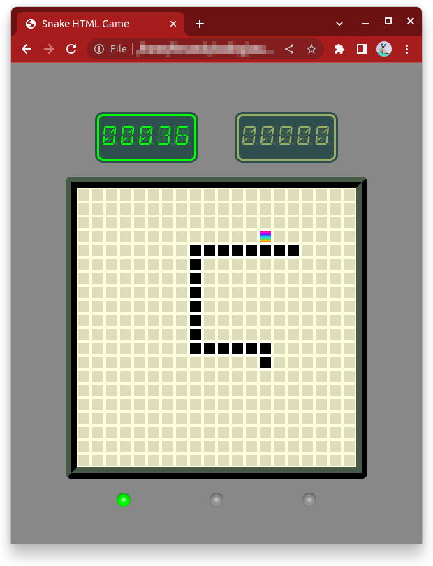

# Snake Game

## Introduction

Welcome to the Snake Game! This is a classic arcade game where you control a snake and try to eat as much food as possible without colliding with the boundaries or your own tail. It's a simple yet addictive game that will test your reflexes and strategic thinking.

## How to Play

1. Open the `index.html` file in a web browser.
2. Use the **arrow or "wasd" keys** on your keyboard to control the snake's movement.
3. You can move while the green LED
4. Use the **space key** to pause the game, a yellow LED will be activated.
5. The snake will start moving automatically in the direction you specify.
6. Guide the snake to eat the food represented by rainbow dots on the game board.
7. Each time the snake eats food, it will grow longer.
8. The game ends when the snake crashes into a boundary or itself.
9. When the game is over, a red LED will be activated.

## Food Types

-   Rainbow Food
    -   No speed change
    -   Adds 2 points
-   Hot Food
    -   Increase speed in 1 frame/second
    -   Adds 3 points
-   Chill Food
    -   Decrease speed in 1 frame/second
    -   Adds 1 points
-   SUPER Hot Food
    -   Sets max speed
    -   Adds 5 points
-   SUPER Chill Food
    -   Sets min speed
    -   No points added

## TODO List

-   Add button to reset game.
-   Add random obstacles.
-   Implement record score for the current session.
-   Persist record score on local database.
-   Introduce power-ups that provide temporary advantages or challenges.
-   Implement multiplayer functionality to compete with friends.

## Technologies Used

-   HTML5
-   CSS3
-   JavaScript

## License

This project is licensed under the [MIT License](LICENSE).
