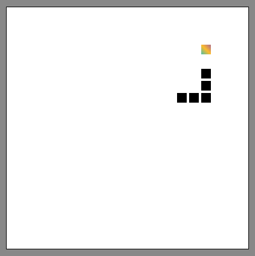

# Snake Game

## Introduction

Welcome to the Snake Game! This is a classic arcade game where you control a snake and try to eat as much food as possible without colliding with the boundaries or your own tail. It's a simple yet addictive game that will test your reflexes and strategic thinking.

## How to Play

1. Open the `index.html` file in a web browser.
2. Use the arrow keys on your keyboard to control the snake's movement.
3. The snake will start moving automatically in the direction you specify.
4. Guide the snake to eat the food represented by red dots on the game board.
5. Each time the snake eats food, it will grow longer.
6. Be careful not to collide with the boundaries of the game board or your own tail.
7. The game ends when the snake crashes into a boundary or itself.
8. A "Game Over!" message will be displayed, and you can restart the game by refreshing the page.

## Customization and Extension

The Snake Game provided here is a basic version, but you can customize and extend it to add your own unique features. Here are some ideas:

-   Add different levels of difficulty with faster snake speed or additional obstacles.
-   Implement a scoring system to keep track of the player's score.
-   Introduce power-ups that provide temporary advantages or challenges.
-   Enhance the visual design with colorful graphics and animations.
-   Implement multiplayer functionality to compete with friends.

Feel free to get creative and experiment with new ideas to make the game your own!

## Technologies Used

-   HTML5
-   CSS3
-   JavaScript

## Acknowledgements

This Snake Game project was inspired by the classic Snake game and various online resources on game development. The code provided here serves as a starting point for your own Snake game implementation and can be modified and improved according to your needs.

## License

This project is licensed under the [MIT License](LICENSE).
